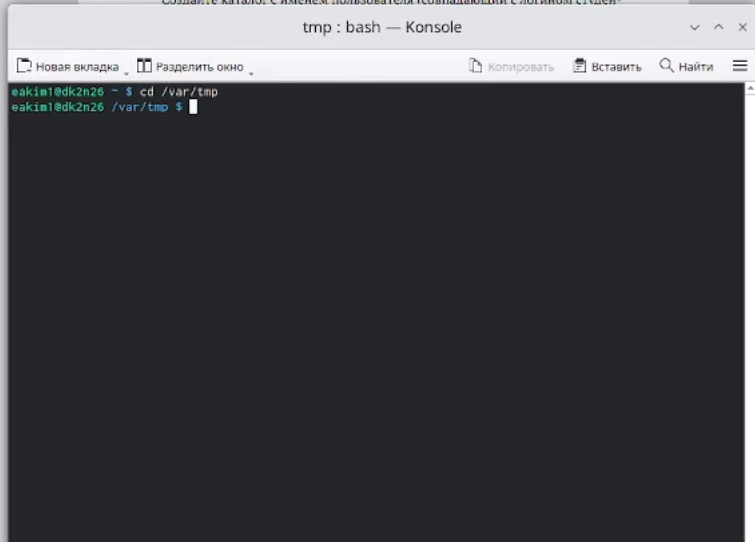
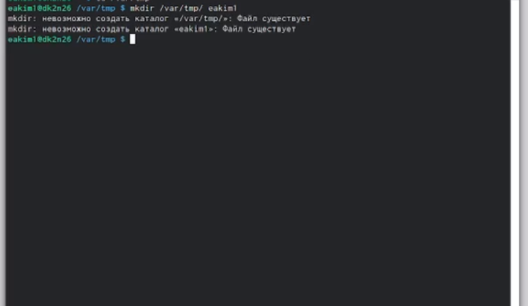
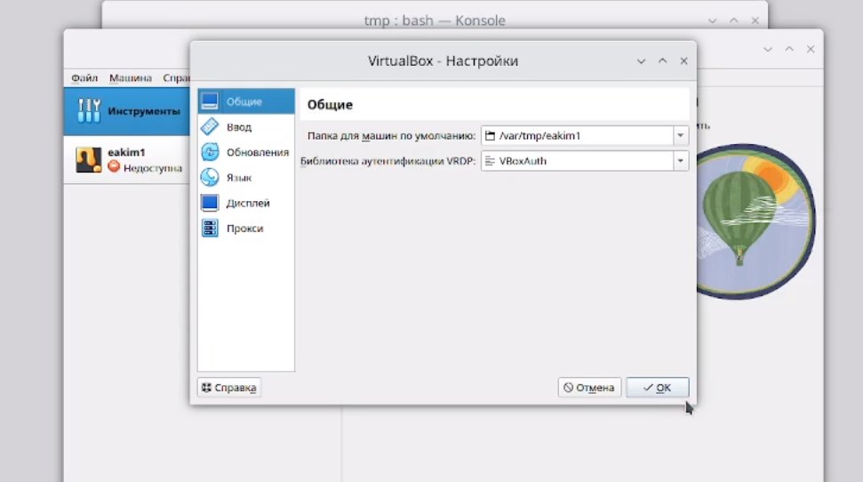
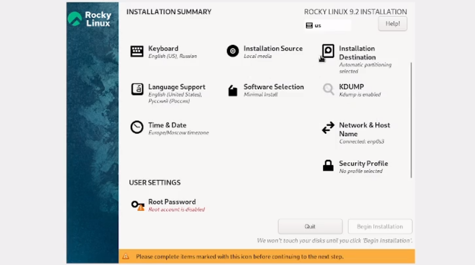
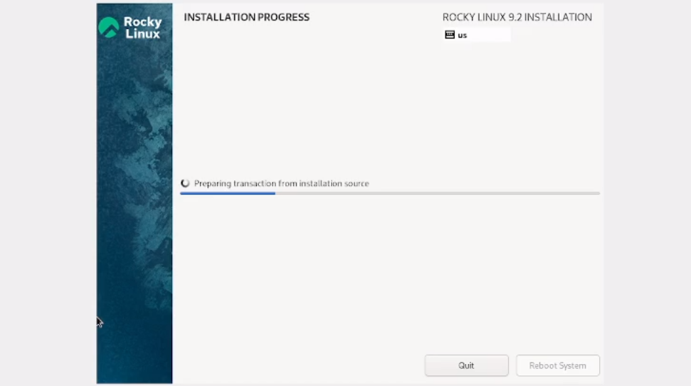
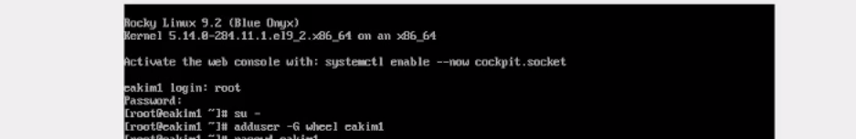
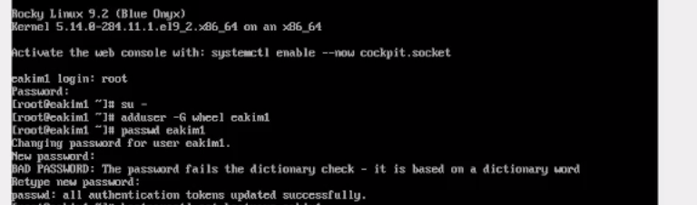
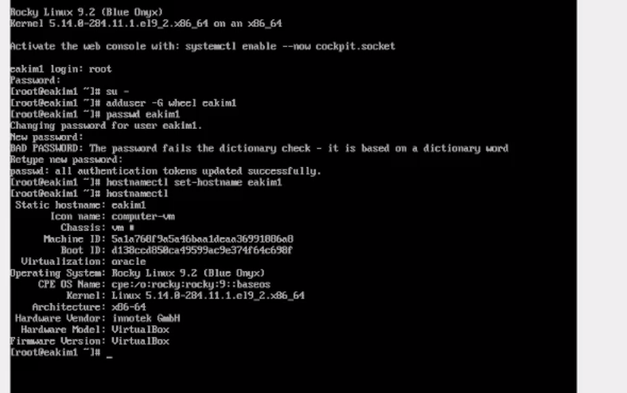
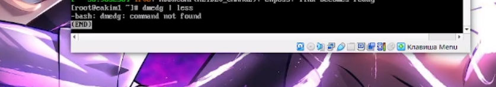
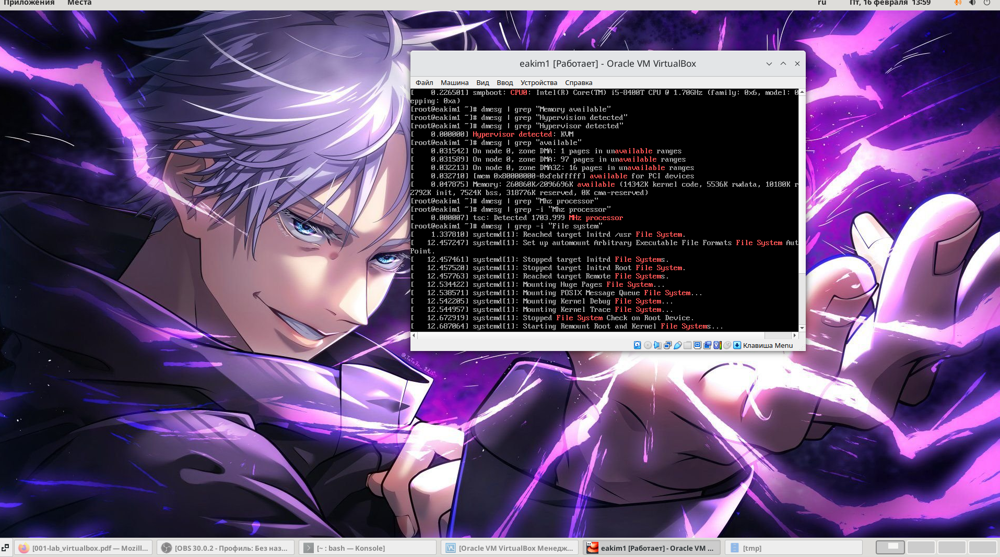

---
## Front matter
lang: ru-RU
title: Лабораторная работа №1
subtitle: Установка и конфигурация операционной системы на виртуальную машину
author:
  - Ким Э.А
institute:
  - Российский университет дружбы народов, Москва, Россия

## i18n babel
babel-lang: russian
babel-otherlangs: english

## Formatting pdf
toc: false
toc-title: Содержание
slide_level: 2
aspectratio: 169
section-titles: true
theme: metropolis
header-includes:
 - \metroset{progressbar=frametitle,sectionpage=progressbar,numbering=fraction}
 - '\makeatletter'
 - '\beamer@ignorenonframefalse'
 - '\makeatother'
---

# Информация

## Докладчик

:::::::::::::: {.columns align=center}
::: {.column width="70%"}

  * Ким Эрика Алексеевна 
  * НБИ-02-22
  * РУДН 

:::
::: {.column width="30%"}

:::
::::::::::::::

## Цели и задачи

- Целью данной работы является приобретение практических навыков установки операционной системы на виртуальную машину, настройки минимально необходимых для дальнейшей работы сервисов.

## Этапы работы

1. Загрузите в дисплейном классе операционную систему Linux. Осуществите
вход в систему. Запустите терминал. Перейдите в каталог /var/tmp:
cd /var/tmp

{#fig:001 width=90%}

##

2. Создайте каталог с именем пользователя (совпадающий с логином студента в дисплейном классе). Для этого можно использовать команду: mkdir /var/tmp/`id -un`или непосредственно: mkdir /var/tmp/имя_пользователя
 
{#fig:002 width=90%}

##

3. Запустите виртуальную машину, введя в командной строке:
 
{#fig:003 width=90%}

##

4. Устоновили все нужные настройки в виртуальной машине.
  
{#fig:004 width=90%} 

##

5. После загрузки дополнений нажмите Return или Enter и корректно переза-
грузите виртуальную машину.

{#fig:005 width=90%}
 
##

6. Запустите виртуальную машину и залогиньтесь.Запустите терминал и получите полномочия администратора: su -
  
{#fig:006 width=90%}

##

7. Создайте пользователя (вместо username укажите ваш логин в дисплей-
ном классе): adduser -G wheel username

{#fig:007 width=90%}

##

8. Задайте пароль для пользователя (вместо username укажите ваш логин
в дисплейном классе): passwd username

{#fig:008 width=90%}

##

9. Установите имя хоста (вместо username укажите ваш логин в дисплейном
классе): hostnamectl set-hostname username. Проверьте, что имя хоста установлено верно:
hostnamect

{#fig:009 width=90%} 

##

10.  Дождитесь загрузки графического окружения и откройте терминал. В окне
терминала проанализируйте последовательность загрузки системы, выпол-
нив команду dmesg. Можно просто просмотреть вывод этой команды: dmesg | less

{#fig:010 width=90%}

##

11.  Домашнее задание: Можно использовать поиск с помощью grep:
dmesg | grep -i "то, что ищем"
Получите следующую информацию. 
Версия ядра Linux (Linux version).
Частота процессора (Detected Mhz processor).
Модель процессора (CPU0).
Объем доступной оперативной памяти (Memory available).
Тип обнаруженного гипервизора (Hypervisor detected).
Тип файловой системы корневого раздела.

{#fig:011 width=90%}

  
## Вывод 

- мы молодцы 

:::
