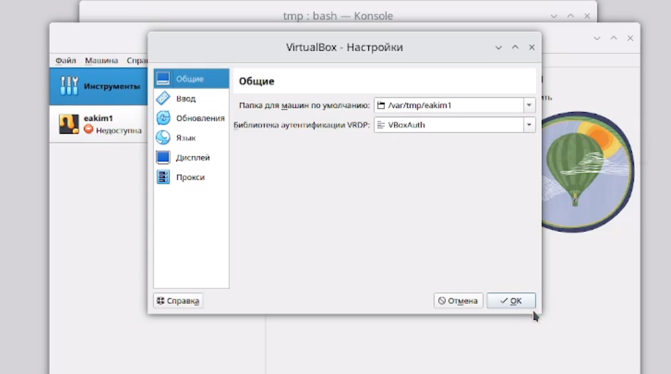
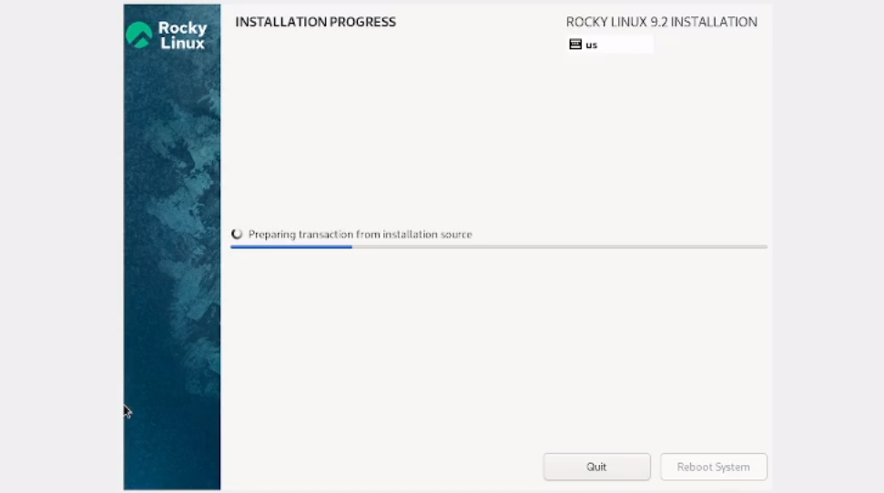
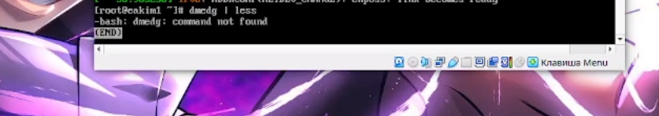
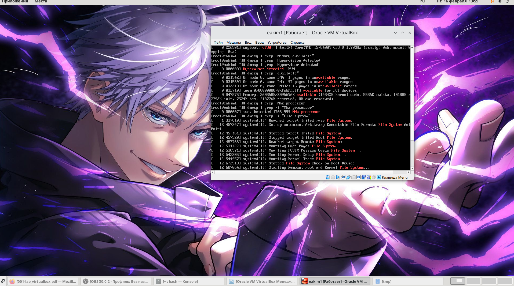

---
## Front matter
title: "Лабораторная работа №1" 
subtitle: "Установка и конфигурация операционной системы на виртуальную машину"
author: "Ким Эрика Алексеевна"

## Generic otions
lang: ru-RU
toc-title: "Содержание"

## Bibliography
bibliography: bib/cite.bib
csl: pandoc/csl/gost-r-7-0-5-2008-numeric.csl

## Pdf output format
toc: true # Table of contents
toc-depth: 2
lof: true # List of figures
lot: true # List of tables
fontsize: 12pt
linestretch: 1.5
papersize: a4
documentclass: scrreprt
## I18n polyglossia
polyglossia-lang:
  name: russian
  options:
	- spelling=modern
	- babelshorthands=true
polyglossia-otherlangs:
  name: english
## I18n babel
babel-lang: russian
babel-otherlangs: english
## Fonts
mainfont: PT Serif
romanfont: PT Serif
sansfont: PT Sans
monofont: PT Mono
mainfontoptions: Ligatures=TeX
romanfontoptions: Ligatures=TeX
sansfontoptions: Ligatures=TeX,Scale=MatchLowercase
monofontoptions: Scale=MatchLowercase,Scale=0.9
## Biblatex
biblatex: true
biblio-style: "gost-numeric"
biblatexoptions:
  - parentracker=true
  - backend=biber
  - hyperref=auto
  - language=auto
  - autolang=other*
  - citestyle=gost-numeric
## Pandoc-crossref LaTeX customization
figureTitle: "Рис."
tableTitle: "Таблица"
listingTitle: "Листинг"
lofTitle: "Список иллюстраций"
lotTitle: "Список таблиц"
lolTitle: "Листинги"
## Misc options
indent: true
header-includes:
  - \usepackage{indentfirst}
  - \usepackage{float} # keep figures where there are in the text
  - \floatplacement{figure}{H} # keep figures where there are in the text
---

# Цель работы

Целью данной работы является приобретение практических навыков установки операционной системы на виртуальную машину, настройки минимально необходимых для дальнейшей работы сервисов.

# Выполнение лабораторной работы

1. Загрузите в дисплейном классе операционную систему Linux. Осуществите
вход в систему. Запустите терминал. Перейдите в каталог /var/tmp:
cd /var/tmp

{#fig:001 width=90%}

2. Создайте каталог с именем пользователя (совпадающий с логином студента в дисплейном классе). Для этого можно использовать команду: mkdir /var/tmp/`id -un`или непосредственно: mkdir /var/tmp/имя_пользователя
 
{#fig:002 width=90%}

3. Запустите виртуальную машину, введя в командной строке:
 
{#fig:003 width=90%}

4. Устоновили все нужные настройки в виртуальной машине.
  
{#fig:004 width=90%} 

5. После загрузки дополнений нажмите Return или Enter и корректно переза-
грузите виртуальную машину.

{#fig:005 width=90%}
  
6. Запустите виртуальную машину и залогиньтесь.Запустите терминал и получите полномочия администратора: su -
  
{#fig:006 width=90%}

7. Создайте пользователя (вместо username укажите ваш логин в дисплей-
ном классе): adduser -G wheel username

{#fig:007 width=90%}

8. Задайте пароль для пользователя (вместо username укажите ваш логин
в дисплейном классе): passwd username

{#fig:008 width=90%}

9. Установите имя хоста (вместо username укажите ваш логин в дисплейном
классе): hostnamectl set-hostname username. Проверьте, что имя хоста установлено верно:
hostnamect

{#fig:009 width=90%} 

10.  Дождитесь загрузки графического окружения и откройте терминал. В окне
терминала проанализируйте последовательность загрузки системы, выпол-
нив команду dmesg. Можно просто просмотреть вывод этой команды: dmesg | less

{#fig:010 width=90%}

11.  Домашнее задание: Можно использовать поиск с помощью grep:
dmesg | grep -i "то, что ищем"
Получите следующую информацию. 
Версия ядра Linux (Linux version).
Частота процессора (Detected Mhz processor).
Модель процессора (CPU0).
Объем доступной оперативной памяти (Memory available).
Тип обнаруженного гипервизора (Hypervisor detected).
Тип файловой системы корневого раздела.

{#fig:011 width=90%}

  
  
  
# Выводы

Приобрели практические навыки установки операционной системы.

# Список литературы{.unnumbered}

::: {#refs}
:::
