---
## Front matter
lang: ru-RU
title: Лабораторная работа 2
subtitle: "Дискреционное разграничение прав в Linux. Основные атрибуты"
author:
  - Ким. Э. А.
institute:
  - Российский университет дружбы народов, Москва, Россия
date: 29 февраля 2024

## i18n babel
babel-lang: russian
babel-otherlangs: english

## Formatting pdf
toc: false
toc-title: Содержание
slide_level: 2
aspectratio: 169
section-titles: true
theme: metropolis
header-includes:
 - \metroset{progressbar=frametitle,sectionpage=progressbar,numbering=fraction}
 - '\makeatletter'
 - '\beamer@ignorenonframefalse'
 - '\makeatother'
---

# Информация

## Докладчик

:::::::::::::: {.columns align=center}
::: {.column width="70%"}

  * Ким Эрика Алексеевна 
  * НБИ-02-22
  * РУДН 

:::
::: {.column width="30%"}

:::
::::::::::::::

## Цели и задачи

- Получение практических навыков работы в консоли с атрибутами файлов, закрепление теоретических основ дискреционного разграничения доступа в современных системах с открытым кодом на базе ОС Linux1.

## Этапы работы

1. В установленной при выполнении предыдущей лабораторной работы операционной системе создали учётную запись пользователя guest (использую учётную запись администратора):useradd guest. Задали пароль для пользователя guest (использую учётную запись администратора):passwd guest. Войдите в систему от имени пользователя guest.
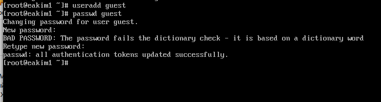{#fig:001 width=70%}

##

2. Определили директорию, в которой мы находимся, командой pwd. Сравнили её с приглашением командной строки. Определили, является ли она нашей домашней директорией? Если нет, зашли в домашнюю директорию. 

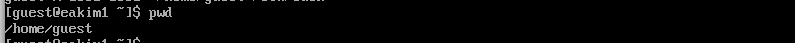{#fig:002 width=70%}

##

3. Уточнили имя вашего пользователя командой whoami. 
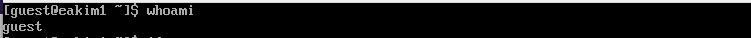{#fig:003 width=70%}

##

4. Уточнили имя пользователя, его группу, а также группы, куда входит пользователь, командой id. Выведенные значения uid, gid и др. запомнили. Сравнили вывод id с выводом команды groups. 
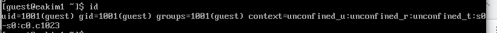{#fig:004 width=70%}

##

5. Просмотрите файл /etc/passwd командой cat /etc/passwd.

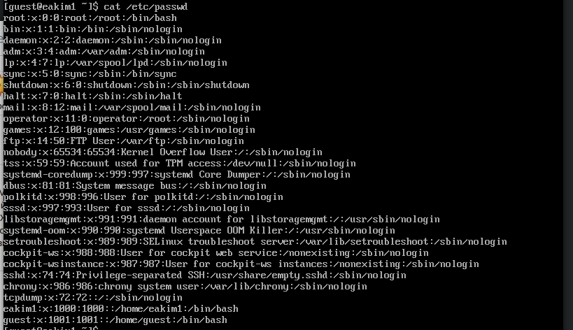{#fig:005 width=70%}

##

6. Нашли в нём свою учётную запись. 

{#fig:006 width=70%}

##

7. Замечание: в случае, когда вывод команды не умещается на одном экране монитора, используйте прокрутку вверх–вниз (удерживая клавишу shift, нажимайте page up и page down) либо программу grep в качестве фильтра для вывода только строк, содержащих определённые буквенные сочетания: cat /etc/passwd | grep guest 
{#fig:007 width=70%}

##

8. Определили существующие в системе директории командой ls -l /home/.

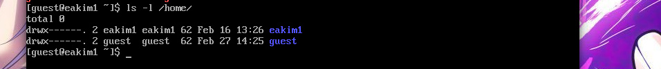{#fig:008 width=70%}

##

9. Проверили, какие расширенные атрибуты установлены на поддиректориях, находящихся в директории /home, командой: lsattr /home.

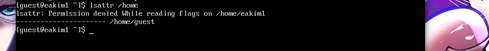{#fig:009 width=70%}

##

10. Создали в домашней директории поддиректорию dir1 командой mkdir dir1.

{#fig:010 width=70%}

##

11. Определили командами ls -l и lsattr, какие права доступа и расширенные атрибуты были выставлены на директорию dir1.

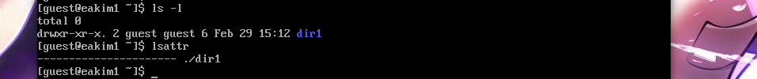{#fig:011 width=70%}

##

12. Сняли с директории dir1 все атрибуты командой chmod 000 dir1 и проверили с её помощью правильность выполнения команды ls -l.
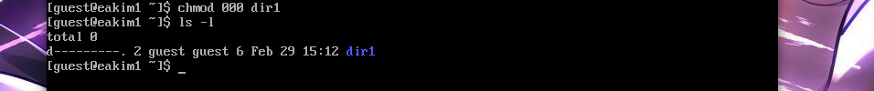{#fig:012 width=70%}

##

13.  Попытайтесь создать в директории dir1 файл file1 командой echo "test" > /home/guest/dir1/file1 Объясните, почему вы получили отказ в выполнении операции по созданию файла? Оцените, как сообщение об ошибке отразилось на создании файла? Проверьте командой ls -l /home/guest/dir1 действительно ли файл file1 не находится внутри директории dir1

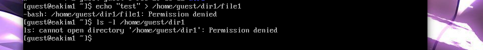{#fig:013 width=70%}

##

14. Заполнили таблицу 2.1.

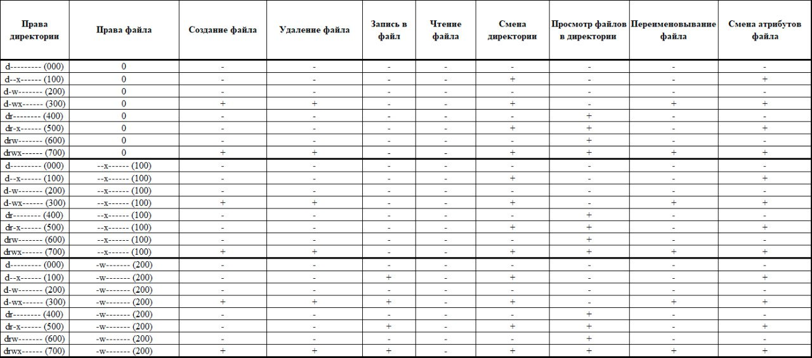{#fig:014 width=70%}

##

{#fig:015 width=70%}

##

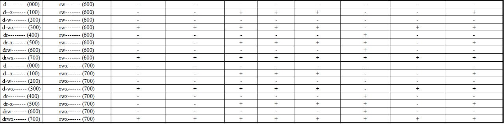{#fig:016 width=70%}

##

15. Заполнили таблицу 2.2.

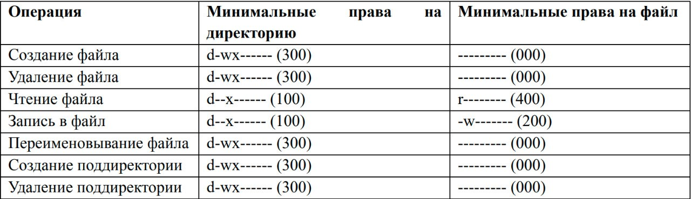{#fig:017 width=70%}

##

  
## Вывод 

- мы молодцы 

:::
