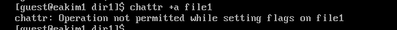
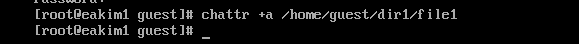
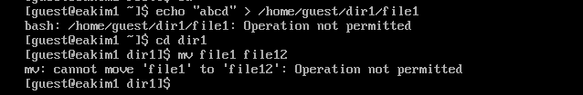
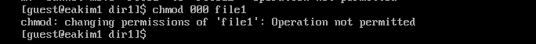
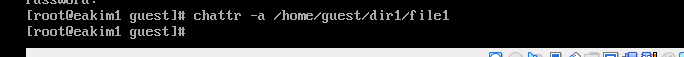
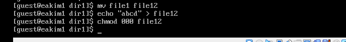

---
## Front matter
lang: ru-RU
title: Лабораторная работа 4
subtitle: "Дискреционное разграничение прав в Linux. Расширенные атрибуты"
author:
  - Ким. Э. А.
institute:
  - Российский университет дружбы народов, Москва, Россия
date: 26 марта 2024

## i18n babel
babel-lang: russian
babel-otherlangs: english

## Formatting pdf
toc: false
toc-title: Содержание
slide_level: 2
aspectratio: 169
section-titles: true
theme: metropolis
header-includes:
 - \metroset{progressbar=frametitle,sectionpage=progressbar,numbering=fraction}
 - '\makeatletter'
 - '\beamer@ignorenonframefalse'
 - '\makeatother'
---

# Информация

## Докладчик

:::::::::::::: {.columns align=center}
::: {.column width="70%"}

  * Ким Эрика Алексеевна 
  * НБИ-02-22
  * РУДН 

:::
::: {.column width="30%"}

:::
::::::::::::::

## Цели и задачи

- Получение практических навыков работы в консоли с расширенными атрибутами файлов1

## Этапы работы

1. От имени пользователя guest определили расширенные атрибуты файла /home/guest/dir1/file1 командой lsattr /home/guest/dir1/file1  

{#fig:001 width=70%}

##

2. Установили командой chmod 600 file1 на файл file1 права, разрешающие чтение и запись для владельца файла 

{#fig:002 width=70%}

##

3. Попробовали установить на файл /home/guest/dir1/file1 расширенный атрибут a от имени пользователя guest: chattr +a /home/guest/dir1/file1 

{#fig:003 width=70%}

##

4. Зашли на третью консоль с правами администратора либо повысили права с помощью команды su. Попробовали установить расширенный атрибут a на файл /home/guest/dir1/file1 от имени суперполь зователя: chattr +a /home/guest/dir1/file1 

{#fig:004 width=70%}

##

5. От пользователя guest проверили правильность установления атрибута: lsattr /home/guest/dir1/file1 

{#fig:005 width=70%}

##

6. Выполнили дозапись в файл file1 слова «test» командой echo "test" /home/guest/dir1/file1. После этого выполнили чтение файла file1 командой cat /home/guest/dir1/file1. Убедились, что слово test было успешно записано в file1. 

{#fig:006 width=70%}

##

7. Попробовали удалить файл file1 либо стереть имеющуюся в нём информацию командой echo "abcd" > /home/guest/dirl/file1.Попробовали переименовать файл. 
{#fig:007 width=70%}

##

8. Попробовали с помощью команды chmod 000 file1 установить на файл file1 права, например, запрещающие чтение и запись для владельца файла. Команда сработала. 

{#fig:008 width=70%}

##

9. Сняли расширенный атрибут a с файла /home/guest/dirl/file1 от имени суперпользователя командой
chattr -a /home/guest/dir1/file1. 

{#fig:009 width=70%}

##

10. Повторили операции, которые ранее не удавалось выполнить. 

{#fig:010 width=70%}

##

  
## Вывод 

- мы молодцы 

:::
